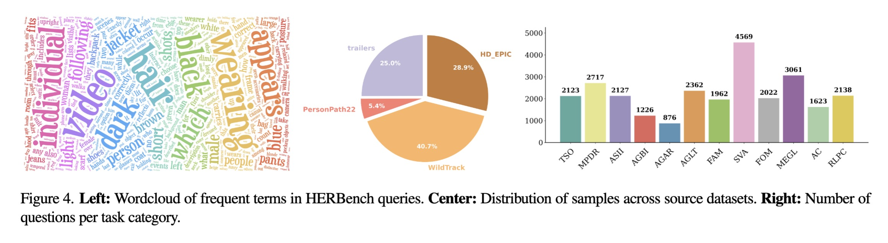
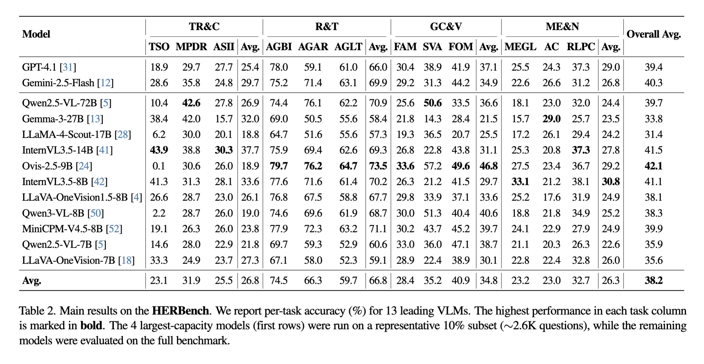
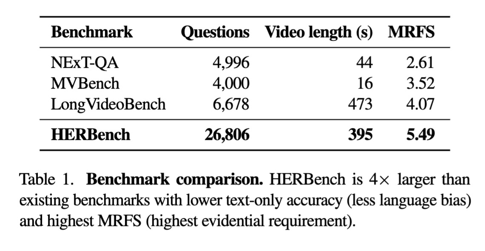

# HERBench: A Benchmark for Multi-Evidence Integration in Video Question Answering

Official repository for the paper "HERBench: A Benchmark for Multi-Evidence Integration in Video Question Answering".

<p align="center">
  
</p>

## Overview

HERBench is a benchmark designed to evaluate how vision-language models integrate and reason over multiple pieces of evidence in videos. Unlike existing benchmarks that often allow questions to be answered from a single salient cue, HERBench enforces a **High Evidential Requirement (ER)**: each question requires aggregating at least **k ≥ 3 distinct, temporally separated visual cues**.

**Key Features:**
- 26,806 five-way multiple-choice questions across 12 compositional tasks
- Average video length: 395 seconds (6.6 minutes)
- Mean MRFS (Minimum Required Frame-Set): 5.49 - significantly higher than existing benchmarks
- Rigorous quality control to eliminate language priors and single-frame shortcuts

<p align="center">
  
</p>

## Download Benchmark Data

The HERBench dataset will be released soon on both **Hugging Face** and **GitHub**.

**Coming Soon:**
- 📦 Hugging Face Dataset: `[organization]/HERBench` (link will be added upon release)
- 📦 Direct Download: Available via this repository

Once released, you can download the benchmark using:

```bash
# Via Hugging Face (recommended)
python scripts/download_data.py --source huggingface

# Or via direct download
python scripts/download_data.py --source direct
```

**Benchmark Contents:**
- 26,806 multiple-choice questions (JSON format)
- 336 unique videos (various formats, average length: 395s)
- Task metadata and annotations
- Precomputed frame embeddings (optional, for faster evaluation)

## Installation

### Prerequisites
- Python 3.8-3.12
- CUDA-compatible GPU (recommended: 48GB+ VRAM for large models)
- PyTorch 2.0+

### Quick Setup

```bash
# Clone the repository
git clone https://github.com/your-username/HERBench.git
cd HERBench

# Create and activate conda environment
conda env create -f environment.yml
conda activate herbench

# Install HERBench package
pip install -e .
```

**Note:** The benchmark data download will be available once the dataset is released (see "Download Benchmark Data" section above).

## Quick Start

### Supported Models

Currently implemented:
- **Qwen2.5-VL-7B-Instruct** (`model=qwen25vl`)
- **InternVL3.5-8B** (`model=internvl35`)

### Run Evaluation

```bash
# Qwen2.5-VL with uniform frame selection
python evaluation/run_evaluation.py model=qwen25vl frame_selector=uniform

# InternVL3.5-8B with BLIP-based frame selection
python evaluation/run_evaluation.py model=internvl35 frame_selector=blip
```

### Calculate Metrics

```bash
# Calculate accuracy
python evaluation/calculate_accuracy.py \
    --predictions results/predictions_qwen25vl_uniform.json

# Calculate MRFS (Minimum Required Frame Set)
python evaluation/calculate_mrfs.py \
    model=qwen25vl \
    frame_selector=blip \
    mrfs.min_frames=1 \
    mrfs.max_frames=16
```

For detailed configuration options, advanced usage, and information on adding custom models or frame selectors, see [USAGE_GUIDE.md](USAGE_GUIDE.md).

## Results

### Main Results

State-of-the-art models achieve only 31-42% accuracy (random baseline: 20%), revealing fundamental limitations in multi-evidence reasoning:

<p align="center">
  
</p>

### MRFS Analysis

HERBench requires significantly more evidence integration than existing benchmarks:
<p align="center">
  
</p>

**Key Findings:**
1. **Frame selection is a major bottleneck** - Adaptive selectors outperform uniform sampling but still lag behind oracle keyframes
2. **Multi-evidence reasoning is a bottleneck** - Even with oracle frames, models struggle to integrate complementary information

## Citation

If you use HERBench in your research, please cite:

```bibtex
@article{herbench2025,
  title={HERBench: A Benchmark for Multi-Evidence Integration in Video Question Answering},
  author={[Authors]},
  journal={CVPR},
  year={2026}
}
```

## License

This project is licensed under the MIT License - see the [LICENSE](LICENSE) file for details.

## Contact

For questions or issues, please:
- Open an issue on GitHub
- Contact the authors at [email]
